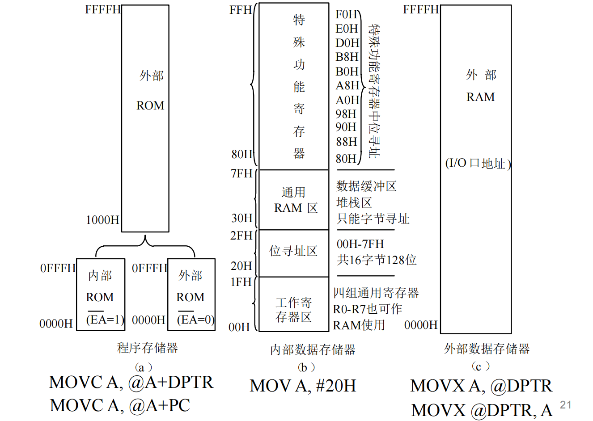

``` yaml
title: 微机原理笔记
author: zzh
created: 2026-01-01
type: note
tags:
  - asm
  - 微机原理
status: 进行中
importance: 5★
note: 5天速通微机原理
```

## ==第二章 8051的结构与原理==

### 0. 8051的结构

地址总线16bit 数据总线8bit 控制总线6根

**1. 端口线**

4个8位并行I/O接口P0，P1，P2和P3，端口是特殊功能寄存器里面的SFR，对应于新品外面的物理引脚

**P0**：内部开关直接接地，当输入无效，输出为低电平。外扩时的数据总线及低8位地址总线的分时复用口。

**P1**：内部为上拉电阻模式，当输入无效，输出为高电平。作为纯GPIO

**P2**：内部为上拉电阻模式，当输入无效，输出为高电平。作为纯GPIO或者地址总线的高八位，当作为地址总线时，会与P0进行协同，还有重点是**只有在访问“片外存储器”或“片外外设”时，才用 P0 和 P2。**

>**内部情况**： 如果你写 MOV A, P1 或者 MOV A, 30H（访问内部 RAM），这一切都发生在单片机肚子里。CPU 内部有自己的高速线路，完全不需要 P0 和 P2 跑到外面去大喊大叫。这时候 P0 和 P2 该干嘛干嘛（比如点灯），不会受到任何影响。
>**外部情况**（用到 P0/P2 时）： 只有当你用了 MOVX 指令（访问外部 RAM）或者程序大到要跑去外部 ROM 读取时，CPU 才会征用 P0 和 P2，让它们变成“地址/数据总线”。

**P3**：内部为上拉电阻模式，当输入无效，输出为高电平。比较特殊，作为GPIO，当复用时有其他第二功能。

**2. 控制线**

**（1）RST/VPD**：复位信号/备用电源线引脚。当在RST引脚上出现24个时钟周期（2个机器周期）以上的高电平，系统初始复位。
**（2）XTAL1和XTAL2**：XTAL1脚为片内振荡器反相放大器及内部时钟发生器的输入端，XTAL2脚为片内振荡器反相放大器的输出端。外接石英晶体或时钟信号，给系统提供时钟。
**（3）PSEN**：是一个输出信号引脚（选通端），它是 8051 访问外部程序存储器的读选通信号。当单片机确定要从外部读取指令时，它会向外发送一个低电平脉冲，那么单片机就会从外部ROM读取对应数据了。
**（4）ALE/ $\overline{PROG}$** ：
**（5）$\overline{EA}$ /VPP**：决定程序是从内部 ROM 开始读，还是直接从外部 ROM 开始读。

### 1. 计算机结构的两种类型

（1）**哈佛架构**：51的结构，ROM RAM可以有相同地址，CPU访问ROM和RAM使用的是不同的访问指令。

（2）**普林斯顿架构（冯诺依曼架构）**：RAM ROM合一的结构，其一个地址对应唯一的一个存储器单元，CPU访问ROM和访问RAM使用的是相同的访问指令。如8086芯片。

### 2. 存储器



#### PART.左边：ROM程序存储器

左边的就是ROM了，是存放所写的代码。

- 总空间是0000H-FFFFH 是2^16Byte，也就是64KB
- 核心：用 $\overline{EA}$ 进行控制，External Access，这是低电平有效的，当为0时，访问外部ROM；当为1时，访问内部ROM。
- =1，选择内部ROM，如果程序超过了 4KB (地址 > 0FFFH)，它会自动跳转到片外 ROM 去执行。
- =0，选择外部ROM，它完全忽略片内 ROM，直接从片外 ROM 的 0000H 开始执行。

#### PART.中间：内部RAM

00H - FFH，只有256个字节的空间，在物理上分成了上下两半（虽然地址看似连续）。  

**低 128 字节 (00H - 7FH)：真正的 RAM 区**

- **00H - 1FH (工作寄存器区)：** 这里有 4 组 R0~R7。通过修改 PSW 寄存器中的 RS0/RS1 位，可以切换当前使用哪一组。这就是为什么在汇编里用`MOV A, R0` 很快，因为它直接映射到这里的内存。  
这里的工作寄存器，Rx，都是8bit的，但是有时候会写为`MOV R3, #0EEH`，看着是12bit，但开头的‘0’是不占位宽的，这是用了语法糖，在汇编器（Assembler）的语法规则中，如果一个十六进制数的第一位是字母（A~F），必须在前面加一个 0，用于区分是变量还是数值。

>这里使用PSW去控制第几组工作寄存器，一共有4组。
PSW寄存器控制组别的方法:PSW有0-7共8bit，PSW.4 = RS1, PWS.3 = RS0，通过这两个进行确定组别 RS1：RS0
00 **Bank 0**：地址00H - 07H（复位后默认使用）
01 **Bank 1**：地址08H - 0FH
10 **Bank 2**：地址10H - 17H
11 **Bank 3**：地址18H - 1FH

- **20H - 2FH (位寻址区)：** **重点！** 这 16 个字节也就是 128 个位 ()。
  
- 你之前问的 `BIT` 伪指令，通常就是映射到这里。
  
- 比如 `SETB 00H` 指令，操作的就是 20H 字节的第 0 位。

- **30H - 7FH (通用 RAM 区)：** 用户随便用的区域，通常用来放堆栈（Stack）和普通变量。

**高 128 字节 (80H - FFH)：特殊功能寄存器 (SFR) 区**

- 这里不是普通内存，而是**硬件控制器的映射**。

- `P0-P3`, `SP`, `ACC`, `B`, `PSW` 等都在这里。
- **注意：** 只有地址能被 8 整除的寄存器（如 80H, 90H, A0H...）才能进行**位操作**。
- **专用指令：** `MOV`。
- 例如 `MOV A, #20H`。只要没带后缀，默认就是操作这里。

#### PART.右边：外部数据存储器 (External Data Memory / XRAM)

这是用来**扩展**用的。当内部 RAM 不够用（比如要做大容量的数据缓存、接外部 ADC 芯片）时，就用到这里。

* **总空间：** 64KB。
* **特点：** 虽然地址也是 0000H 开始，但它和程序存储器是两条平行的线，互不干扰。
* **I/O 口地址：** 图中提到 "I/O口地址"，指的是如果我们把外设（如 8255 扩展芯片）挂在总线上，单片机会把它们看作是片外 RAM 的一个地址单元（统一编址）。
* **专用指令：** `MOVX` (Move External)。
* 图下方的 `MOVX A, @DPTR`。注意那个 **"X"**，代表 External。
* **这是常见的坑：** 同样是地址 `1000H`，如果你用 `MOVC` 读的是 ROM，用 `MOVX` 读的就是外部 RAM。

### 3. 时钟与时序

1. **时钟周期**（节拍）与状态：振荡周期，由单片机内部振荡电路OSC产生。
2. **机器周期**：
3. **指令周期**：
4. **ALE地址锁存地址线**：用于访问外部ROM时的地址锁存，实现P0脚的地址/数据复用。ALE以晶振1/6的频率输出正脉冲。

>在访问外部存储器的前半个周期，P0 输出的是地址。此时 ALE 发出一个正脉冲，告诉外部的锁存器（如 74HC573）：“现在的 P0 是地址，快存起来！”
在后半个周期，P0 变成数据总线进行读写。
注意和 $\overline{EA}$ 不一样，$\overline{EA}$ 是选择内部ROM还是外部ROM的，ALE是控制p0是地址还是数据的。
>因为有了锁存器和 ALE 信号，原本的一组引脚就变身成了两组功能。

### 4. 特殊的寄存器（PPT第二章有详细讲）

1. **DPTR(Data Pointer)**，16bit专用寄存器，大容量，可以分为DPH和DPL。  是用来存放16位的地址，这就意味着它可以指向 64KB ($2^{16}$) 的存储空间。
它主要用于以下两种“大范围”的寻址场景：
（1）访问外部数据存储器 (External RAM)：当你要读写片外 RAM（特别是地址超过 256 字节范围）时，必须用 DPTR 来存放地址
（2）访问程序存储器 (ROM) —— 查表与跳转：用于在 ROM 中查找数据（如字模表）或进行散转跳转。由于它可以覆盖整个 64KB 的 ROM 空间，所以被称为“远程查表”。

```asm
;操作方式
MOV DPTR, #2000H  ; 把 16进制数 2000H 直接送入 DPTR [cite: 218, 927]
INC DPTR          ; 让 DPTR 的值加 1 
;如果要让DPTR减1，那么是需要对DPTR的高位和低位分别处理的。

错误案例：
（1）ADD DPL, #01H ;51 单片机不支持 16 位数的加法指令，且ADD 指令只能用于累加器 A。
修正：
MOV A, DPL
ADD A, #01H
MOV DPL, A
```


## ==第三章 8051的汇编语言与程序设计==

### 1. 伪指令

汇编语言的组成有：指令性语句和指示性语句（伪指令）
**指令性语句：**是进行汇编语言程序设计的可执行语句，每条指令都产生相应的机器语言的目标代码
**伪指令：**是控制汇编过程的一些命令。伪指令不产生机器语言的目标代码，不可被CPU执行的语句。

#### 第一类：控制代码位置与结束

* **ORG (Origin) - 定位**
* **功能：** 告诉编译器，接下来的代码从内存的哪个地址开始放。
* **场景：** 程序开头通常写 `ORG 0000H`。

* **END - 结束汇编**
* **功能：** 告诉编译器“编译到此结束”，后面的内容不再处理。
* **场景：** 必须放在整个 `.asm` 文件的最后一行。

#### 第二类：给东西起名字（赋值与定义）

* **EQU (Equate) - 赋值**
* **功能：** 给数字或符号起个名字（宏定义）。不可更改。
* **场景：** 定义常量，如 `SPEED EQU 100`。

* **DATA - 数据地址赋值**
* **功能：** 专门用来给 **RAM 地址**起名字。
* **场景：** 定义变量，如 `COUNT DATA 30H`（把 30H 单元叫 COUNT）。

* **BIT - 位地址定义**
* **功能：** 给 **位地址**起名字。
* **场景：** 定义引脚，如 `LED BIT P1.0`。

#### 第三类：在内存里占位或存数据（预留空间）

* **DB (Define Byte) - 定义字节**
* **功能：** 在程序存储器里存入 8 位数据。
* **场景：** 存表格、字符串、数码管段码。

* **DW (Define Word) - 定义双字节**
* **功能：** 在程序存储器里存入 16 位数据（高位在前）。
* **场景：** 存大整数、地址表。

* **DS (Define Space) - 预留空间**
* **功能：** 只占位，不存具体数据（跳过 N 个字节）。
* **场景：** 为将来的数组或缓冲区预留内存空间。

### 2. 8051汇编指令的分类

➢ 按字节分：单字节、双字节、三字节
➢ 按周期分：单周期、双周期、四周期
➢ 按功能分：数据传送指令（29条）、算术操作指令（24条）、逻辑操作指令（24条）、控制转移指令（17条）和位操作指令（17条）

### 3. 寻址方式

### 4. 数据传送指令

1. **内部RAM数据传送指令**
(1) 以累加器A为目的操作数的指令（Move to Accumulator）
(2) 以工作寄存器Rn为目的操作数的指令（Move to Register）
(3) 以直接地址（内部RAM或SFR寄存器）为目的操作数的指令(Move to direct)
(4) 以寄存器间接地址为目的操作数的指令（Move to indirect）
(5) 16位数据传送指令（Load Data Point with a 16-bit constant）

2. **外部RAM数据传送指令**
CPU与外部RAM之间进行数据传送必须通过**累加器A**完成，并且也只能采用寄存器间接寻址。

3. **程序存储器（ROM）数据传送指令**
程序存储器的内容是只读的，因此其数据传送是单向的，并且只能写入 ***累加器A*** 中。 主要需要区分DPTR和PC作为地址偏移的区别。

4. **数据交换指令**
**第一类：半字节（4-bit）交换指令**
这类指令只处理 8 位数据中的其中 4 位（半个字节，也叫 Nibble）。

   1. **`SWAP A`**

   - **含义**：**A 内部的高低 4 位互换**。
   - **公式**：$(A)_{3 \sim 0} \longleftrightarrow (A)_{7 \sim 4}$
   - **例子**：假设 A = `25H` (二进制 `0010 0101`)
   - 执行 `SWAP A` 后
   - A = `52H` (二进制 `0101 0010`)
   - **用途**：常用于 BCD 码处理或者取出一个字节的高 4 位。

   2. **`XCHD A, @Ri`** (Exchange Digit)

   - **含义**：**只交换低 4 位**。A 的低 4 位和 Ri 指向的内存地址的低 4 位互换，**高 4 位都不变**。
   - **公式**：$(A)_{3 \sim 0} \longleftrightarrow ((Ri))_{3 \sim 0}$
   - **例子**：
   - A = `36H` (高位3，低位6)
   - RAM[R0] = `58H` (高位5，低位8)
   - 执行 `XCHD A, @R0` 后：
   - A = `38H` (3不变，6换成了8)
   - RAM[R0] = `56H` (5不变，8换成了6)

    **第二类：整字节（8-bit）交换指令**
    这类指令最常用，就是把整个 8 位数据完全互换。

   1. **`XCH A, Rn`**
   - **含义**：A 和通用寄存器 R0~R7 的值互换。
   2. **`XCH A, direct`**
   - **含义**：A 和直接地址（如 P1 口、30H 地址等）的值互换。
   3. **`XCH A, @Ri`**
   - **含义**：A 和 Ri (R0或R1) 指向的 RAM 地址的值互换。

5. **堆栈操作指令**
用于执行中断、子程序调用、参数传递等程序保护断点和现场地址。是实现RAM单元数据送入栈顶或由栈顶取出数据送至RAM单元。是以栈指针SP为间址寄存器的间址寻址方式。
**`push direct`** 把direct地址对应的数据进栈到栈顶
**`pop direct`** 把栈顶数据出栈到direct地址

### 5. 算术指令

4. **乘除指令** 
（1）**乘法指令：MUL AB**
含义： Multiply A and B（A 乘以 B）。
操作前：A：存放被乘数。B：存放乘数。
操作后（结果）：A：存放积的低 8 位。B：存放积的高 8 位。
公式： $A \times B = BA$ (注意这里 B 是高位，A 是低位)举个例子：假设 $A = 50 (32H)$，$B = 10 (0AH)$。
执行 MUL AB 后：$50 \times 10 = 500$。500 的十六进制是 01F4H。结果：B = 01H (高位)，A = F4H (低位)。
***OV 标志位的作用：*** 如果积大于 255 (FFH)，说明 A 装不下了，必须用到 B，此时 OV = 1。如果积小于等于 255，B 就是 0，此时 OV = 0。  
（2）**除法指令：DIV AB**
含义： Divide A by B（A 除以 B）。
操作前：A：存放被除数（分子）。B：存放除数（分母）。
操作后（结果）：A：存放商 (Quotient)。B：存放余数 (Remainder)。
举个例子：假设 $A = 13$， $B = 5$。执行 DIV AB 后：$13 \div 5 = 2 \dots \dots 3$结果：A = 2 (商)，B = 3 (余数)。
**OV 标志位的作用**：在除法中，只有当 除数为 0 (B=0) 时，OV = 1，表示除法溢出（非法操作）。否则 OV = 0。  
==**注意**==
寄存器是写死的，只能使用AB这两寄存器进行乘法除法运算，而不能用其他寄存器。

5. **加1指令 INC和减1指令 DEC**  
```asm
## 1. 加 1 指令 (Increment)
; 作用：将指定目标中的数值加 1，结果写回原处
INC A       ; (A) <== (A) + 1          [累加器加1]
INC Rn      ; (Rn) <== (Rn) + 1        [工作寄存器 R0-R7 加1]
INC @Ri     ; ((Ri)) <== ((Ri)) + 1    [间接寻址指向的 RAM 单元加1]
INC direct  ; (direct) <== (direct) + 1 [直接地址(如 30H)内容加1]
INC DPTR    ; (DPTR) <== (DPTR) + 1    [16位数据指针加1]

## 2. 减 1 指令 (Decrement)
; 作用：将指定目标中的数值减 1，结果写回原处
DEC A       ; (A) <== (A) - 1          [累加器减1]
DEC Rn      ; (Rn) <== (Rn) - 1        [工作寄存器 R0-R7 减1]
DEC @Ri     ; ((Ri)) <== ((Ri)) - 1    [间接寻址指向的 RAM 单元减1]
DEC direct  ; (direct) <== (direct) - 1 [直接地址内容减1]

## 3. 核心差异点 (重点记忆)
; 注意观察：INC 有 5 条指令，而 DEC 只有 4 条。
; 唯一的区别在于 16 位寄存器 DPTR：
; ✅ 合法：INC DPTR  (可以自增)
; ❌ 非法：DEC DPTR  (没有这条指令！)
```

### 6. 控制转移指令

#### 1. 无条件转移指令

1. **LJMP**
2. **AJMP**
3. **SJMP**
4. **JMP**

#### 2. 条件转移指令

1. **JZ rel**
2. **JNZ rel**

#### 3. 比较转移指令

要考试了，到此为止

